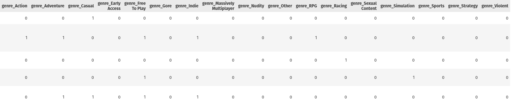

# Video Game Sales on Steam Prediction Report

## Table of Contents

  - [Team CS 6 Details](#team-cs-6-details)
  - [Preprocessing](#preprocessing)
    - [Preprocessing DLCs and Demos CSVs](#preprocessing-dlcs-and-demos-csvs)
    - [Merging CSVs and Creating Training, Validation, and Test Sets](#merging-csvs-and-creating-training-validation-and-test-sets)
      - [Merging CSVs](#merging-csvs)
      - [Splitting Data Into Training, Validation, and Test Sets](#splitting-data-into-training-validation-and-test-sets)
    - [Preprocessing Info Base Games CSV](#preprocessing-info-base-games-csv)
      - [Preproccess App ID Column](#preproccess-app-id-column)
      - [Preproccess Name Column](#preproccess-name-column)
      - [Preproccess Metacritic Column](#preproccess-metacritic-column)
      - [Preproccess Three Boolean Columns](#preproccess-three-boolean-columns)
      - [Preprocess Genres Column](#preprocess-genres-column)
      - [Preprocess Achievements Columns](#preprocess-achievements-columns)
      - [Preprocess Release Date Column](#preprocess-release-date-column)
      - [Preprocess Supported Platforms Column](#preprocess-supported-platforms-column)
    - [Preprocessing Gamalytic Steam Games CSV](#preprocessing-gamalytic-steam-games-csv)
      - [Preprocess Price, Copies Sold, and Review Score Columns](#preprocess-price-copies-sold-and-review-score-columns)
      - [Preprocess Publisher Class and AI Content](#preprocess-publisher-class-and-ai-content)
  - [Feature Selection](#feature-selection)
    - [Regression](#regression)
      - [Correlation Matrix](#correlation-matrix)
      - [ANOVA](#anova)
      - [Recursive Feature Elimination (RFE)](#recursive-feature-elimination-rfe)
      - [Mutual Information](#mutual-information)
    - [Classification](#classification)
  - [Hyper Parameter Tuning, Training, and Testing](#hyper-parameter-tuning-training-and-testing)
    - [Regression](#regression-1)
      - [Results Using RFECV and GridSearch After Inverting The Log Transformation On Target Variable](#results-using-rfecv-and-gridsearch-after-inverting-the-log-transformation-on-target-variable)
      - [Results Using Mutual Information Feature Selection With Applying Quantile Transformer On The Target Variable And Inverting The Transformation After Making Predictions](#results-using-mutual-information-feature-selection-with-applying-quantile-transformer-on-the-target-variable-and-inverting-the-transformation-after-making-predictions)
    - [Classification](#classification-1)
      - [Classification Summaries](#classification-summaries)
      - [Hyperparameter Tuning](#hyperparameter-tuning)
  - [Conclusions](#conclusions)
    - [Regression](#regression-2)
    - [Classification](#classification-2)

<div style="page-break-after: always; visibility: hidden"> 
\pagebreak 
</div>

## Team CS 6 Details

| Name                        | Student ID |
|-----------------------------|-------------|
| احمد خالد احمد يسري         | 2022170016  |
| كريم حاتم أحمد محمد رضوان   | 2022170311  |
| ملك خالد محمد بخيت محمود الحادي | 2022170432  |
| مريم محمد على محفوظ      | 2022170418  |
| على اشرف ابراهيم سيد         | 2022170256  |
| محمود محمد حسين توفيق         | 2022170400  |

<div style="page-break-after: always; visibility: hidden"> 
\pagebreak 
</div>

## Preprocessing

### Preprocessing DLCs and Demos CSVs


1. Dropped the auto incremented column in Demos "Unnamed".
2. Made column names consistent.

   

3. Removed duplicated rows.
4. Cleaned the Demos'/DLCs' names by removing leading or trailing whitespace, non-alphanumeric characters, and the words "Demo" or "DLC".
5. Engineered 4 new features for the main games
    1. has_dlc
    2. has_demo
    3. demo_count
    4. dlc_count

**Note**  
We didn't extract features from the Demos'/DLCs' names since we are gamers ourselves, and based on our domain-knowledge in games we strongly believe that the names of the Demos/DLCs of the games don't affect the number of copies sold by any means, on the other hand we extracted multiple features from the main game name.

<div style="page-break-after: always; visibility: hidden"> 
\pagebreak 
</div>

### Merging CSVs and Creating Training, Validation, and Test Sets

#### Merging CSVs

We merged both the `gamalytic_steam_games` and `info_base_games` CSVs together based on that for a game to be merged, it must exist in both. This resulted in `69426` rows instead of the original `99167` in `info_base_games`. We then merged the 4 features we engineered from `demos` and `dlcs` with the games we had using the game id.

#### Splitting Data Into Training, Validation, and Test Sets

We performed this step early on so that all the next preprocessing steps can fit only on the training data, and then transform all the training, validation, and test sets to **avoid data leakage**.

After research on the size of our data, we decided to do a 8-1-1 split, which resulted in the below datasets


We initially thought we needed a validation set to use to tune the hyperparameters of the models, although later on we used Grid Search to tune the hyperparameters with less/cleaner code and Grid Search automatically creates a validation set inside the training set using cross validation, whcih meant that the validation set we created was not needed, so later on during feature selection and model training we would first combine the validation and testing sets into one bigger testing set, so the actual split ratio we have is **training (8) -> testing (2)**.

**Note**  
In all of the below preprocessing, we fit on the training data, and transform the training, validation, and test sets.

<div style="page-break-after: always; visibility: hidden"> 
\pagebreak 
</div>

### Preprocessing Info Base Games CSV


**Note**  
It is standard that we check if a column contains null values, if I didn't mention it, then we checked and found out that it doesn't contain any null values.

#### Preproccess App ID Column

1. Dropped a corrupted row/sample that contained the column names

   

#### Preproccess Name Column

1. Removed punctuation.
2. Transformed names to lowercase.
3. Feature Engineered the below features  
    1. Name Length
    2. Word count
    3. Ratio of capital letters to total length
    4. Is a sequel (if the game is e.g., part 2 of another game), we did this by using regex to check if the game name contains any english or roman numbers.
    5. Multiple boolean features each indicating if the game contains any of these keywords (vr, remaster, collector, edition, bundle, playtest)

    
4. Standardized the numerical features engineered using `StandardScaler`
5. Converted game names to word embeddings using pre-trained models `SentenceTransformer('all-MiniLM-L6-v2')`

**Note**   
We didn't test the effictivness of word embeddings since they had very high dimensionality (around 380 features), due to the time constraints and the low probability that they will be useful, we deprioritized trying to apply PCA on them and testing them during feature selection.

<div style="page-break-after: always; visibility: hidden"> 
\pagebreak 
</div>

#### Preproccess Metacritic Column

Around 97% of the games in our data didn't have a metacritic score associated with them and the metacritic score for them is null, this is due to Steam leaving it optional for games' publishers to include a metacritic score on their Steam page.

We plotted the distribution of the Metacritic score


1. Since the Metacritic score is normally distributed, we also applied standardization on it.

2. Imputed the missing values with the mean of the 3% of the data, we didn't want to automatically drop the column since we thought that it might have a value, which later on, it proved it did.

3. We feature engineered a boolean `has_metacritic` feature

   


#### Preproccess Three Boolean Columns

The three boolean columns are `steam_achievements`, `steam_trading_cards`, and `workshop_support`.

We simply converted the boolean values `True`, `False` -> 1, 0.  
But `steam_achievements` is a bit tricky since it has a relation with `achievements_total` so we will revist preprocessing it while discussing preprocessing `achievements_total`.

<div style="page-break-after: always; visibility: hidden"> 
\pagebreak 
</div>

#### Preprocess Genres Column

1. Analyzed and Visualized the Genres Frequency

   

2. Replaced genres that are not related to games (which also are the genres that have the lowest frequecy) with an "Other" genre.

   ```python
    non_game_genres = [
    'Photo Editing', 'Video Production', 'Web Publishing', 'Accounting',
    'Audio Production', 'Software Training', 'Design & Illustration',
    'Utilities', 'Game Development', 'Education', 'Animation & Modeling'
    ]
   ```
   
3. Multi-Hot Encoded the genres by splitting them into lists and using sklearn's `MultiLabelBinarizer`

   

**Note**  
We first tested out multi-hot encoding genres without grouping non-game related genres into an "Other" category and it gave bad results with linear regression, so we applied the non-game related grouping and it improved the results.

<div style="page-break-after: always; visibility: hidden"> 
\pagebreak 
</div>

#### Preprocess Achievements Columns

Around 46% of the data in `achievements_total` was missing, and it is important to mention that `achievements_total` is highly related with the boolean feature `steam_achievements`.

1. Made both columns consistent with each other.
   1. if `achievements_total` had a value and `steam_achievements` was False, we converted it into True.
   2. if `steam_achievements` was False, and `achievements_total` was Null, we set `achievements_total` = 0.

2. Tested imputing the null values in `achievements_total` using KNN Imputer but it gave unrealistic results so we didn't use it. 

3. Imputed the null values in `achievements_total` with the median of the column.

4. Standardized `achievements_total` using sklearn's `StandardScaler`

<div style="page-break-after: always; visibility: hidden"> 
\pagebreak 
</div>

#### Preprocess Release Date Column

This is an interesting column since it contains null values and multiple date formats.

**Unified Release Date Formats and Feature Engineering**

**Release Date Formats**

The following release date formats are standardized as described below:

1. **Formats with Day, Month, and Year**  
   - Original: `8-Dec-2022`, `8 Dec 2022`, `Dec-8-2022`, `Dec 8, 2022`  
   - Standardized: Split into day, month, and year (e.g., `8 Dec 2022`).

2. **Formats with Month and Year Only**  
   - Original: `Dec-2022`, `Dec 2022`  
   - Standardized: Assign day as `15` (midpoint of the month) for consistency, e.g., `15 Dec 2022`.

3. **Quarterly Formats**  
   - Original: `Q1 2023`, `Q2-2024`, etc.  
   - Standardized: Assign day as `15` and month as the middle month of the quarter:  
     - `Q1`: `15 Feb` (e.g., `15 Feb 2023`)  
     - `Q2`: `15 May` (e.g., `15 May 2024`)  
     - `Q3`: `15 Aug`  
     - `Q4`: `15 Nov`

4. **Formats with Day and Month Only (No Year)**  
   - Original: `8-Dec`  
   - Standardized: Assign year as `null` (e.g., `8 Dec null`).

5. **Year-Only Formats**  
   - Original: `2023`  
   - Standardized: Assign day as `1` and month based on release context:  
     - Past release: `1 Jan` (e.g., `1 Jan 2023`)  
     - Future release: `1 Jun` (e.g., `1 Jun 2023`).

6. **Vague or Placeholder Formats**  
   - Original: `Coming soon`, `To be announced`  
   - Standardized: Assign as `null` for day, month, and year.

<div style="page-break-after: always; visibility: hidden"> 
\pagebreak 
</div>

**Feature Engineering**

The following features are derived from the standardized release dates:

1. **is_upcoming**  
   - Type: Boolean  
   - Description: Indicates if the release is in the future.  
   - Logic: Set to `1` if the year is in the future, or if the date is `Coming soon` or `To be announced`.

2. **is_release_date_known**  
   - Type: Boolean  
   - Description: Indicates if a specific release date is known.  
   - Logic: Set to `1` if the release date is specific (includes day, month, and year, whether past or future). Set to `0` for `Coming soon`, `To be announced`, or dates without a year (e.g., `8-Dec`).

3. **year**  
   - Type: Integer  
   - Description: The year of the release date, extracted from the standardized format. Set to `null` if not specified.

4. **sin_day**  
   - Type: Float  
   - Description: Cyclical encoding of the day of the year using sine transformation.  
   - Formula: `sin(2 * π * (day_number_in_year / 365))`  
   - Purpose: Captures seasonal patterns.

5. **cos_day**  
   - Type: Float  
   - Description: Cyclical encoding of the day of the year using cosine transformation.  
   - Formula: `cos(2 * π * (day_number_in_year / 365))`  
   - Purpose: Complements `sin_day` to capture seasonal spikes.

- The `sin_day` and `cos_day` features use cyclical encoding to model periodic patterns, such as seasonal release spikes, by representing the day of the year as a point on a unit circle.
- The day number in the year is calculated based on the standardized date (e.g., `15 Dec 2022` is approximately the 349th day of the year).
- For dates with `null` values (e.g., `Coming soon` or no year), `sin_day` and `cos_day` are not computed and may be set to `null` or a default value depending on the implementation.

<div style="page-break-after: always; visibility: hidden"> 
\pagebreak 
</div>

#### Preprocess Supported Platforms Column

Multi-Hot Encoded the supported platforms by converting them into python lists and using sklearn's `MultiLabelBinarizer`.


<div style="page-break-after: always; visibility: hidden"> 
\pagebreak 
</div>

### Preprocessing Gamalytic Steam Games CSV


#### Preprocess Price, Copies Sold, and Review Score Columns

1. Checked duplicates, missing values, and negative values.

2. Analyzed Skewness
    ```
    Price skewness: 35.86
    CopiesSold skewness: 98.31
    reviewScore skewness: -1.28
    ```
3. Applied Log Transformation for the skewed data (Price, Copies Sold) using `np.log1p`

4. Handled Outliers in Review Score using Interquartile range (IQR).

5. Standardized Price and Review Score, didn't standardize Copies Sold since it's the target variable and this won't help models, we tested standardizing it but it didn't have any effect so we removed it.

6. Analyzed the data's distribution
   
   | 1 | 2 | 3 |
    |:-------:|:-------:|:-------:|
    |  |  |  |

<div style="page-break-after: always; visibility: hidden"> 
\pagebreak 
</div>

#### Preprocess Publisher Class and AI Content

1. Analyzed Publisher Class Data

    | Frequency Of Class | Copies Sold Per Class |
    |:-------:|:-------:|
    |  |  |

    This strongly indicates that AA and AAA publishers sell a lot more copies that Indie and Hobbyists.

2. Based on the above frequency of the classes and since AA and AAA publishers are closely related, we decided to merge AA and AAA publishers into an "Others" publishers category.

    

3. Used Dummy Encoding (A smarter way of doing one-hot encoding that makes us need `n - 1` columns, where `n` is the original number of categories to encode) to encode the publisher classes using sklearn's `OneHotEncoder`

    

4. Dropped AI Content column since it contained 100% NULL values.

<div style="page-break-after: always; visibility: hidden"> 
\pagebreak 
</div>

## Feature Selection

### Regression

#### Correlation Matrix


```
Dropped 3 highly correlated features: ['demo_count', 'dlc_count', 'name_words']
Pairs of features (dropped, highly correlated with dropped): [('demo_count', 'has_demo'), ('dlc_count', 'has_dlc'), ('name_words', 'name_len')]
```

<div style="page-break-after: always; visibility: hidden"> 
\pagebreak 
</div>

**Top 10 Features Correlation To Target**


#### ANOVA


Both categorical features have ANOVA values that indicate their correlation with the target variable.

<div style="page-break-after: always; visibility: hidden"> 
\pagebreak 
</div>

#### Recursive Feature Elimination (RFE)

`RFE` is a wrapper method that needs as input the number of features to select, at first, we manually implemented `RFECV` ourselves so we can see how R2 score changes with the number of features.

**Note**  
At first we didn't know that we should invert the log transformation applied on the target variable before evaluating error metrics. After research we are not sure if for R2 the correct way is to invert the log transformation.

**RFE Performance With Linear Regression & XGBoost With Different # Of Features**

**For now, these are our best results before inverting the log transformation**

| 1 | 2 |
|:-------:|:-------:|
|  |  |

**XGBoost Features Selected**
```
→ Number of Features: 31
R² Score: 0.7130
Selected Features (31): ['steam_achievements', 'steam_trading_cards', 'workshop_support', 'achievements_total', 'is_release_date_known', 'year', 'has_metacritic', 'genre_Action', 'genre_Adventure', 'genre_Casual', 'genre_Early Access', 'genre_Free To Play', 'genre_Indie', 'genre_Massively Multiplayer', 'genre_Nudity', 'genre_RPG', 'genre_Racing', 'genre_Simulation', 'genre_Sports', 'genre_Strategy', 'linux', 'mac', 'is_sequel', 'name_has_vr', 'name_has_edition', 'price', 'reviewScore', 'publisherClass_Indie', 'publisherClass_Other', 'has_demo', 'has_dlc']
```

<div style="page-break-after: always; visibility: hidden"> 
\pagebreak 
</div>

**Linear Regression Features Selected**
```
→ Number of Features: 48
R² Score: 0.5290
Selected Features (48): ['steam_achievements', 'steam_trading_cards', 'workshop_support', 'achievements_total', 'is_release_date_known', 'is_upcoming', 'year', 'sin_day', 'cos_day', 'has_metacritic', 'genre_Action', 'genre_Adventure', 'genre_Casual', 'genre_Early Access', 'genre_Free To Play', 'genre_Gore', 'genre_Indie', 'genre_Massively Multiplayer', 'genre_Nudity', 'genre_Other', 'genre_RPG', 'genre_Racing', 'genre_Sexual Content', 'genre_Simulation', 'genre_Sports', 'genre_Strategy', 'genre_Violent', 'linux', 'mac', 'windows', 'name_len', 'name_words', 'name_cap_ratio', 'is_sequel', 'name_has_vr', 'name_has_remaster', 'name_has_collector', 'name_has_collection', 'name_has_edition', 'name_has_bundle', 'price', 'reviewScore', 'publisherClass_Indie', 'publisherClass_Other', 'has_demo', 'demo_count', 'has_dlc', 'dlc_count']
```

Later on, for cleaner code, we removed our implementation of `RFECV` and directly used sklearn's `RFECV`.

<div style="page-break-after: always; visibility: hidden"> 
\pagebreak 
</div>

#### Mutual Information


### Classification

We used RFE for feature selection in classification.

<div style="page-break-after: always; visibility: hidden"> 
\pagebreak 
</div>

## Hyper Parameter Tuning, Training, and Testing

### Regression

#### Results Using RFECV and GridSearch After Inverting The Log Transformation On Target Variable

In the RFE code, we defined 2 models (Linear Regression and XGBoost), we used `RFECV` to feature select, `GridSearchCV` to cleanly hyperparameter tune, we trained on the training set and then used the generated model to predict on the testing set, later on we tried inverting the log transformation on the target variable and then calculating the error metrics.

**Important Note**  
Our training using RFE did not yield good R2 results after removing log transformation on the target variable, so **our final regression models** were obtained with the training code that **uses mutual information feature selection**.

```
Running RFECV for LinearRegression...
Selected 50 features for LinearRegression.
Selected features: ['steam_achievements', 'steam_trading_cards', 'workshop_support', 'achievements_total', 'is_release_date_known', 'is_upcoming', 'year', 'sin_day', 'cos_day', 'price', 'reviewScore', 'has_demo', 'has_dlc', 'has_metacritic', 'genre_Action', 'genre_Adventure', 'genre_Casual', 'genre_Early Access', 'genre_Free To Play', 'genre_Gore', 'genre_Indie', 'genre_Massively Multiplayer', 'genre_Nudity', 'genre_Other', 'genre_RPG', 'genre_Racing', 'genre_Sexual Content', 'genre_Simulation', 'genre_Sports', 'genre_Strategy', 'genre_Violent', 'platform_linux', 'name_has_collection', 'name_has_edition', 'name_has_bundle', 'name_has_playtest', 'publisherClass_Indie', 'publisherClass_Other']

Running GridSearchCV for LinearRegression...
Best parameters for LinearRegression: {'fit_intercept': True, 'positive': False}

Running RFECV for XGBoost...
Selected 30 features for XGBoost.
Selected features: ['steam_achievements', 'steam_trading_cards', 'workshop_support', 'achievements_total', 'is_release_date_known', 'year', 'price', 'reviewScore', 'has_demo', 'has_dlc', 'metacritic_preprocessed', 'has_metacritic', 'genre_Action', 'genre_Adventure', 'genre_Casual', 'genre_Early Access', 'genre_Free To Play', 'genre_Indie', 'genre_Massively Multiplayer', 'genre_Nudity', 'genre_RPG', 'genre_Simulation', 'genre_Sports', 'genre_Strategy', 'platform_linux', 'platform_mac', 'is_sequel', 'name_has_edition', 'publisherClass_Indie', 'publisherClass_Other']

Running GridSearchCV for XGBoost...
Best parameters for XGBoost: {'learning_rate': 0.1, 'max_depth': 6, 'n_estimators': 200}
```


<div style="page-break-after: always; visibility: hidden"> 
\pagebreak 
</div>

#### Results Using Mutual Information Feature Selection With Applying Quantile Transformer On The Target Variable And Inverting The Transformation After Making Predictions

**Important Note**  
These are our best regression results. We tried multiple Gradient Bosting Algorithms, Decision Trees, and Linear Regression, but I only included a
couple of figures here.

**CatBoost**


```
Max R² = 0.2842 at 38 features 
MIN MSE = 312678264912.1818 at 38 features 
MIN MAE = 53109.8411 at 38 features 
```

**XGBoost**

```
Max R² = 0.2467 at 24 features 
MIN MSE = 329091993209.9749 at 24 features 
MIN MAE = 55327.5016 at 24 features 
```

**Linear Regression**

```
Max R² = 0.2537 at 11 features 
MIN MSE = 326023882144.2681 at 11 features 
```

### Classification

We label encoded the target variable, used RFE to feature select, and created code that can hyperparameter tune multiple hyperparameters for each model.

#### Classification Summaries


<div style="page-break-after: always; visibility: hidden"> 
\pagebreak 
</div>

#### Hyperparameter Tuning


## Conclusions

### Regression

The real conclusion is the amount of learning me and my team obtained throughout this milestone.

In regards to the surprises

1. How much the game publisher affects the copies sold.
2. How tree-based models perform a lot better than linear models on this problem.
3. The release date was very effective in the performance, which is very surprising.
4. `has_metacritic` was also unexpectedly beneficial

There is a lot more, but this is a sample of the surprises.

### Classification

Our model likely performs better at classification than regression. Compared to other university teams, we achieved higher classification accuracy, even though some teams had better regression results than us. Initially, I expected our classification accuracy to be lower, but the results surprisingly proved the opposite.